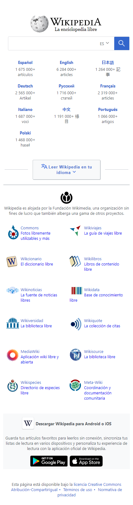

# Clone-WikipediaDesign
Desarrollo del diseño utilizado en el home de Wikipedia con HTML 5 y CSS3. Para el diseño responsive se utilizó el patrón de  maquetación Layout Shifter y siguiendo la estrategia de mobile first.

<h2>Móvil</h2>

<h2>Tablet</h2>

<h2>Escritorio</h2>

