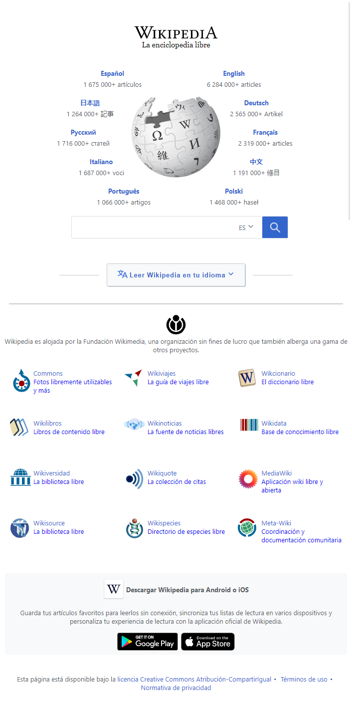
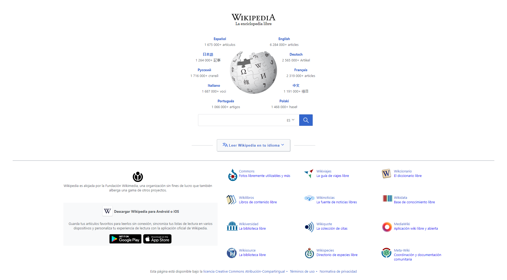

# Clone-WikipediaDesign
Desarrollo del diseño utilizado en el home de Wikipedia con HTML 5 y CSS3. Para el diseño responsive se utilizó el patrón de  maquetación Layout Shifter y siguiendo la estrategia de mobile first.

## Proyecto de Platzi
- [Curso Práctico de HTML y CSS](https://platzi.com/clases/html-practico/)
- [Certificado del curso](https://platzi.com/p/gabycarol04/curso/1758-html-practico/diploma/detalle/)

## Diseño Responsive (Layout Shifter)
### 1. Móvil

### 2. Tablet

### 3. Escritorio

